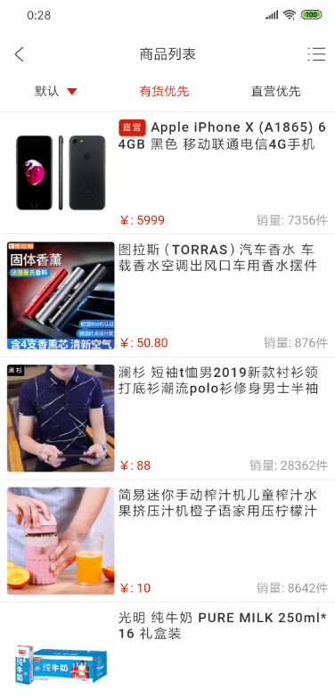

# hybrid-web-jd

该项目为仿京东混合开发项目的web端，使用Vue开发。目前仅兼容了Android端

## Screenshots

## 项目模块与功能

- 商城首页
  - 轮播组件
  - 活动组件
  - 秒杀组件
  - 倒计时组件
  - 商品列表组件(瀑布流)

- 商品列表
  - 筛选器组件
  - 商品排序功能
  - 垂直列表组件
  - 网格布局列表组件
  - 瀑布流列表组件
  
- 商品详情
  - 渐变导航栏组件
  - 组件之间过渡动画
  - 虚拟任务栈
  - 与原生端商品交互

- 购物车
  - 商品编辑
  - Vuex保存商品数据
  - 购物车商品实时计算

- 个人中心
  - 用户登录
  - 用户注册
  - 自动登录验证

## 体验

[点我体验！](http://jd.hybrid.blcheung.club/)